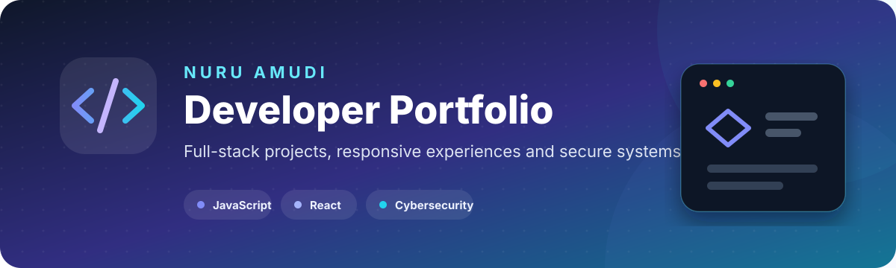

<p align="center">
  
</p>

<p align="center">
  <a href="https://nuru999.github.io/Portfolioo/"></a>
  
  
</p>

## Overview

This is the personal portfolio of **Nuru Amudi**, a software developer and cybersecurity enthusiast based in Nairobi, Kenya.

The website presents selected software projects, education, technical growth, and contact channels in a fast, responsive interface built without a frontend framework.

> **Live portfolio:** [nuru999.github.io/Portfolioo](https://nuru999.github.io/Portfolioo/)

## Portfolio sections

| Section | Purpose |
| --- | --- |
| **Who I Am** | Professional introduction, focus areas, and development approach |
| **Education & Growth** | Software engineering, cybersecurity, and ICDL training |
| **Selected Work** | Six practical development projects with repository links |
| **Achievements** | Skills, progress, and project milestones |
| **Contact** | Direct ways to discuss work and collaboration |

## Selected projects

| Project | Focus | Repository |
| --- | --- | --- |
| **VINEYARD-SMS** | Multi-platform school management system | [View project](https://github.com/nuru999/VINEYARD-SMS) |
| **Farm Inventory** | Flask inventory dashboard and REST API | [View project](https://github.com/nuru999/Farm_inventory) |
| **News App** | React news discovery interface | [View project](https://github.com/nuru999/News-App) |
| **FMI University Website** | Responsive educational website | [View project](https://github.com/nuru999/FMI) |
| **Weather App** | Weather search and forecast experience | [View project](https://github.com/nuru999/Weather-App) |
| **PASS-IT-ON** | Event and community landing page | [View project](https://github.com/nuru999/PASS-IT-ON) |

## Experience and features

- Responsive navigation with a mobile hamburger menu.
- Light and dark themes saved in local storage.
- Smooth scrolling and active-section navigation.
- Project cards with direct source-code links.
- Education timeline and achievement highlights.
- Accessible semantic structure, labels, focus states, and keyboard support.
- Lightweight HTML, CSS, and JavaScript with no build dependency.

## Technology

| Layer | Implementation |
| --- | --- |
| **Structure** | Semantic HTML5 |
| **Styling** | CSS custom properties, Grid, Flexbox, transitions, and responsive breakpoints |
| **Interaction** | Vanilla JavaScript ES6+ |
| **Icons** | Boxicons |
| **Fonts** | Google Fonts |
| **Hosting** | GitHub Pages |

## Project structure

```text
Portfolioo/
├── index.html
├── css/
│   └── style.css
├── js/
│   └── script.js
├── images/
└── assets/
    └── portfolio-banner.svg
```

## Run locally

No installation or build process is required.

```bash
git clone https://github.com/nuru999/Portfolioo.git
cd Portfolioo
python -m http.server 8000
```

Open [http://localhost:8000](http://localhost:8000).

You can also open `index.html` directly or use the VS Code Live Server extension.

## Deployment

The `main` branch is published with GitHub Pages.

After making changes:

1. Test the light and dark themes.
2. Check the navigation at mobile, tablet, and desktop widths.
3. Confirm every project and contact link.
4. Verify image filenames match their exact capitalization.
5. Review the browser console before publishing.

## Accessibility and performance

- Semantic landmarks and a logical heading order.
- Visible keyboard focus and descriptive link text.
- Responsive images and lightweight static assets.
- Reduced dependency overhead and fast CDN hosting.
- Theme colours designed for readable contrast.

## Contact

- **Email:** [muhammadnuru85@gmail.com](mailto:muhammadnuru85@gmail.com)
- **LinkedIn:** [Nuru Amudi](https://www.linkedin.com/in/nuru-ayubu-3237522b7)
- **GitHub:** [@nuru999](https://github.com/nuru999)

---

<p align="center">
  Designed and developed by <a href="https://github.com/nuru999">Nuru Amudi</a>.
</p>